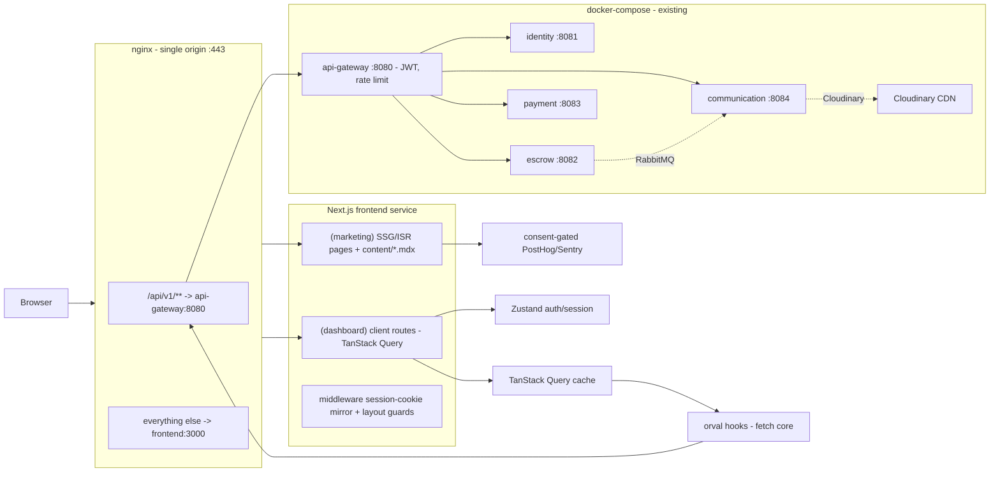
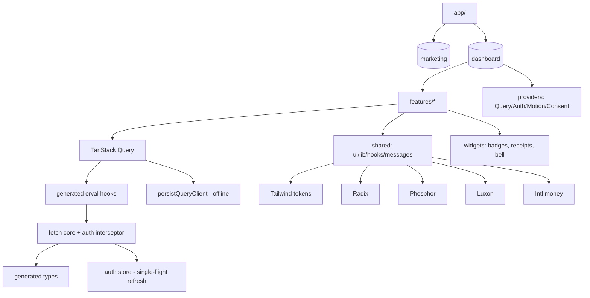

# EaaS Frontend Architecture — Recommendation Document v2.0

**Status:** Approved. **Audience:** senior frontend team. **Evidence base:** backend codebase, `Eaas/*` docs (PRD, NFR, ARCHITECTURE, USER_STORIES, `openapi.yaml`, `schema.sql`), 2026 web ecosystem research.

**Target users:** Nigerian/African mobile-first fintech users — affordable Android devices, low bandwidth, inconsistent connectivity, NGN transactions.

---

## 1. Executive summary

Single **Next.js (App Router)** application containing:
- **(marketing)** — public, SEO-optimized marketing site (SSG at build + on-demand revalidation).
- **(dashboard)** — auth-gated customer, merchant, and admin experiences (client-rendered + TanStack Query; the "ISR equivalent" for authenticated data is per-user client caching, not server page caching).

Deployed as a `frontend` docker-compose service (`output: 'standalone'`) behind an **nginx edge** that single-origin proxies `/api/v1/**` → Spring gateway and everything else → Next. The gateway remains the API/auth edge; tokens never touch the Next server.

### Locked decisions (v2)
| # | Decision |
|---|---|
| 1 | One Next.js App Router app: route groups `(marketing)` and `(dashboard)`, `typedRoutes` |
| 2 | Marketing: SSG at build + on-demand revalidation; metadata API, `sitemap.ts`, `robots.ts`, JSON-LD |
| 3 | Dashboards: client-rendered (no ISR — per-user content cannot share a server page cache); static chrome + client data region |
| 4 | Route protection: middleware session-cookie mirror (pre-render redirect) **plus** client layout guards (token truth stays in memory) |
| 5 | Deployment: nginx → (`frontend` Next standalone `:3000` \| `api-gateway:8080`) single origin; CORS zeroed in prod |
| 6 | Security: CSP with nonce for hydration inline scripts; NDPR cookie-consent banner on marketing (analytics gated) |
| 7 | Icons: **Phosphor** — regular=body, bold=nav/active, duotone whitelist ≤8 money/status icons, `IconContext` defaults |
| 8 | Animation: CSS transitions default + **Motion** `LazyMotion`+`m`+`AnimatePresence` (~4.6KB initial) for trust-critical moments; `useReducedMotion`; no decorative/scroll-linked motion |
| 9 | Data: TanStack Query v5; Zustand (auth/settings only); RHF + Zod; Orval + openapi-typescript from `Eaas/openapi.yaml` |
| 10 | AI content generation: **dropped** — marketing copy is hand-authored `content/*.mdx` |

---

## 2. Repository analysis (evidence)

### 2.1 Backend
- Java 21 + Spring Boot 3.x; Maven modules: `eaas-identity-service` (8081), `eaas-escrow-service` (8082), `eaas-payment-service` (8083), `eaas-communication-service` (8084), `eaas-api-gateway` (8080, Spring Cloud Gateway, reactive).
- RabbitMQ topic exchange: `escrow.*`, `payment.*`, `payout.*`, `user.anonymized`, audit; DLQ per queue; webhook retry TTL+DLX 1m/5m/30m/2h/24h (`ARCHITECTURE.md` §3).
- Per-service MSSQL; Redis (rate limit, idempotency, cache TTLs: escrow 5m, user 15m, fee 1h); Cloudinary (KYC docs, dispute evidence, receipts) — **uploads are server-mediated**.
- Interswitch payments; **amounts are DECIMAL(15,2) major units (naira) on the wire** — kobo conversion is server-side only (`InterswitchClient.java:64,209`). Currency code always accompanies amounts.
- Docker-compose: api-gateway, 4 services, 4× mssql, redis, rabbitmq. No nginx/edge proxy yet.
- No CI (`.github` absent); thin backend tests (3 files); Postman collection = de-facto E2E. No springdoc; `Eaas/openapi.yaml` (1,423 lines) exists but is **stale** (path drift `/admin/disputes/{id}` vs controller `{reference}`; missing notifications/webhooks/KYC/GDPR/AML/fee-config paths).

### 2.2 API contract
- REST only. Envelope `ApiResponse<T> { success, message, data, timestamp }`; gateway auth errors are **plain** `{ error, status, path }` — client handles both shapes.
- Pagination: `?page=0&size=20`, Spring `Page<T>` shape (`content`, `totalElements`, `totalPages`, `number`, `size`, `first`, `last`).
- Uploads: multipart (`POST /merchants/kyc/documents`, `POST /disputes/{id}/evidence`).
- No WebSockets/SSE; no runtime OpenAPI.

### 2.3 Auth & authorization
- JWT Bearer at gateway: access 1h (`expiresIn: 3600000`), refresh 7d **rotated on every use**. Login: `/login`, `/login/customer`, `/login/merchant`, `/login/admin` → `AuthResponse { accessToken, refreshToken, expiresIn, tokenType, user }`.
- Merchant alternative `X-API-Key`. RBAC `CUSTOMER | MERCHANT | SYSTEM | ADMIN` (`UserRole.java`); server-side ownership validation.
- Never call services directly; only the gateway (HMAC-signed downstream).

### 2.4 Domain map
| Domain | Service | Key enums |
|---|---|---|
| Identity/Auth/KYC | 8081 | `UserRole`, `KycStatus (PENDING/UNDER_REVIEW/VERIFIED/REJECTED)`, `DocumentType` |
| Escrow | 8082 | `EscrowStatus` (14: `INITIATED→FUNDED→MERCHANT_NOTIFIED→SHIPPED→DELIVERED→CONFIRMED→RELEASED`; `DISPUTED/UNDER_REVIEW/AUTO_RELEASED/RESOLVED_*/REFUNDED/CANCELLED`), `escrow_state_history` |
| Payments | 8083 | `PaymentStatus (PENDING/PROCESSING/SUCCESS/FAILED/REFUNDED/CANCELLED)`, `PaymentChannel`, `PayoutMethod (BANK_TRANSFER/WALLET)`, AML |
| Disputes | 8084 | `DisputeStatus (OPEN/UNDER_REVIEW/RESOLVED_MERCHANT/RESOLVED_CUSTOMER/CLOSED)`, messages, evidence, `DisputeReason` |
| Notifications | 8084 | `NotificationType (EMAIL/SMS/PUSH/IN_APP)`, `NotificationStatus`, `NotificationPriority` |
| GDPR | 8081 | data export, erasure, consent |

### 2.5 Naming to mirror in TS
camelCase JSON; DTO suffixes (`UserResponse`, `EscrowResponse`); enum literals (`CUSTOMER`, `INITIATED`); reference prefixes `ESC-…`, `POUT-…`, `DISP-…` (display as trust anchors); `Page<T>` wrappers.

---

## 3. Technology stack

### 3.1 Framework — **Next.js (App Router), one app**
Marketing + dashboards in a single codebase (marketing SSG/ISR; dashboards client-rendered). Rationale (2026 research: Techsy, DesignRevision, Meritshot, dev.to):
- Public pages: SSG LCP 1.1–1.8s vs SPA 2.8–3.5s — the marketing site is exactly the case where SSR/SSG wins.
- Dashboards: client components keep the SPA advantages (42KB-class app payload per route, sub-50ms HMR, no hydration cost post-login).
- One deploy, one design system; no marketing/app drift. Hosting: Node via docker-compose (self-host, data-residency friendly); Vercel optional.
- Rejected: Vite SPA alone (cannot deliver SEO marketing), Astro (forces app split), TanStack Start (immature), Remix (inferior SSG story for this need).

### 3.2 Language — TypeScript 5.8 strict
`strict`, `noUncheckedIndexedAccess`, `exactOptionalPropertyTypes`, `noUnusedLocals/Parameters`, `isolatedModules`, `verbatimModuleSyntax`, `moduleResolution: bundler`, `baseUrl` + `paths: { "@/*": ["./src/*"] }`.

### 3.3 Build — Next's built-in (Turbopack in dev, Webpack/Rust bundling in prod)
`output: 'standalone'` for the docker image. No separate build tool decision needed.

### 3.4 Routing — App Router file-based
Route groups: `app/(marketing)/**` (static/ISR), `app/(dashboard)/**` (client). `typedRoutes` experiment on. Layout hierarchy: `(dashboard)/[role]` shells (customer bottom-nav, merchant/admin side-nav).

### 3.5 Data fetching — TanStack Query v5 (client components)
- Retries: capped exponential, **none on 4xx**. `staleTime` aligned to backend Redis TTLs: escrow detail 5m, `me` 15m, fee configs 1h, disputes 5m.
- `refetchOnWindowFocus`, `refetchInterval` 30s on active escrow detail / 60s unread-count; `placeholderData: keepPreviousData` for paged lists; optimistic updates for dispute messages + notification read-state; `persistQueryClient` (bounded) for offline.
- Query keys: `['escrow', ref]`, `['escrows', {page}]`, `['notifications','unread-count']`, `['dispute', id, 'messages']`.

### 3.6 Local UI state — Zustand
`useAuthStore` (tokens, user, session state) + `useSettingsStore` (data-saver, theme). Context for theme/UI shell only. No Redux.

### 3.7 Forms — React Hook Form + Zod
Zod schemas mirror backend `@Valid` rules; one schema file per feature drives both client validation and payload typing. No Formik/Yup.

### 3.8 API client — Orval + openapi-typescript from `Eaas/openapi.yaml`
- **Phase 0 prerequisite:** sync/regenerate the spec (recommended: add springdoc to the 4 services; minimal alternative: hand-sync the YAML).
- `fetch` core (no axios): base URL from env, Bearer injection, dual error-shape handling, 401 → single-flight silent refresh → retry once, abort signals.
- Orval generates typed TanStack Query hooks; **generated output is committed** (CI needs no backend).

### 3.9 Authentication architecture
- Access token in **memory** (Zustand). Refresh token in `localStorage` (server-rotated; risk mitigated by CSP; documented httpOnly-cookie refactor path for later).
- Silent refresh interceptor (single-flight); 401 → refresh → retry → else purge + redirect `?reason=session_expired`.
- Session restore: `GET /auth/me` on boot; cross-tab sync via `BroadcastChannel` + `storage` event.
- **Route protection (locked):** `middleware.ts` checks a short-lived session-cookie mirror (set by the client after login; expires with access token) to redirect `/dashboard/*` → `/login` pre-render **and** client layout guards validate the real in-memory token. Cookie is a redirect accelerator, never an auth authority.
- Session-timeout UX: warning toast at T−5min, countdown, silent refresh; admin re-auth on sensitive actions (resolve dispute, refund, payout retry).

### 3.10 Real-time — deferred
Polling now (3.5); SSE upgrade path documented for when merchant webhook delivery ships. No WebSockets (no chat requirement; budget devices tolerate polling better).

### 3.11 Notifications
Poll `unread-count` (badge), list, mark-read/read-all; toast on count delta. Push deferred (PWA Web Push needs provider + consent UX; not in PRD).

### 3.12 i18n — architecture-ready, English-first
No lib now; central `shared/messages/*` string modules; `Intl` everywhere; future `i18next` (en-NG, pidgin, swahili, fr).

### 3.13 Dates — Luxon
ISO-8601 UTC from backend, rendered in **Africa/Lagos**; 72h confirmation-window countdowns and audit timestamps need correct IANA math.

### 3.14 Money — native Intl, zero deps
`Intl.NumberFormat('en-NG', { style:'currency', currency:'NGN', maximumFractionDigits: 2 })` on major units directly. Utils: `formatMoney`, `formatMoneyCompact`, `amountToWords` (receipts), `libphonenumber-js` (Nigeria-only metadata) for `+234`.

### 3.15 Charts — Recharts (lazy-loaded, merchant/admin only)

### 3.16 Tables — TanStack Table (headless) + shadcn DataTable (server-side paging against `Page<T>`; mobile card collapse)

### 3.17 Virtualization — TanStack Virtual (long transaction lists on budget devices)

### 3.18 Icons — **Phosphor** (locked)
- Why: 6 hand-drawn weights + duotone (optically correct at every weight — no stroke-resize distortion, a documented Lucide flaw at small sizes); fills for active nav/tab states; duotone for money-status icons.
- Discipline: regular=body, bold=nav/active, duotone whitelist ≤8 icons (funded/released/refunded/status set), `IconContext` pins size 20/24 + weight globally. Each weight is separate path data — mixing weights multiplies bundle.
- Measured cost (50 icons, gz, 2026): Phosphor +33.9KB vs Lucide +5.2KB vs react-icons +81KB. The delta is real but contained by the whitelist rule; design-system richness wins per mandate.
- **Do not use:** react-icons (barrel-import bloat), Icon-Sax (proprietary free license — non-transferable, registration, attribution rules; commercial fintech risk with no benefit; community React wrapper), Iconify (runtime fetch).

### 3.19 Animation — **CSS + Motion hybrid** (locked)
- CSS transitions/keyframes (compositor-only) = default for static transforms.
- **Motion** (`motion/react`): `LazyMotion` + `m` (or `useAnimate` mini, WAAPI-backed, 2.3KB) + `AnimatePresence` for trust-critical moments: funding/release confirmation, escrow status timeline (layout animation), receipt reveal, toast/dialog enter-exit.
- Rules: `useReducedMotion` globally; no scroll-linked, drag, or decorative animation; ~6 usage sites, not everywhere. GSAP/React Spring rejected (marketing-weight tooling / physics weight). Optional later: CSS View Transitions API for route transitions behind a feature check.

### 3.20 Uploads — native fetch FormData → backend multipart endpoints
Client-side image compress/resize (canvas ≤1600px, JPEG 0.8) for data cost; indeterminate progress + retry. No client Cloudinary SDK (server-mediated model).

### 3.21 Images — Cloudinary URLs (`f_auto,q_auto,w_`, `dpr_1`), `loading="lazy"`, `width/height` + `aspect-ratio` (CLS)

### 3.22 Error monitoring — Sentry (Vite/Next plugin, release tracing; QueryCache `onError`, error boundaries)

### 3.23 Analytics — PostHog (self-host option for African data residency; NDPR consent-gated)

### 3.24 Feature flags — PostHog flags + local `features.ts` fallback (dev/CI offline)

### 3.25 Testing
- **Unit:** Vitest + RTL (utils, schemas, stores).
- **Integration:** Vitest + MSW + RTL (feature flows against `ApiResponse` fixtures incl. gateway `{error,status,path}` shape).
- **E2E:** Playwright — journeys: marketing crawl (SEO smoke: titles/sitemap/JSON-LD), customer create→pay→confirm, merchant KYC→payout, admin dispute resolve. Run against docker-compose stack.
- Backend has no CI — frontend e2e doubles as backend smoke.

### 3.26 Storybook 8 (CSF3; a11y addon, mobile viewports, light/dark); component docs via stories + feature READMEs

### 3.27 Monorepo — standalone `frontend/` in this repo (no npm workspaces; single app)

---

## 4. Design system

### 4.1 Personality — "Calm Ledger"
Trust, financial security, professionalism, African-first, minimal cognitive load. Every screen answers: *what state is my money in?* Money states = color + label + icon (never color alone).

### 4.2 Palette (WCAG AA; CI contrast audit)
**Light:** `--bg #F7F8FA`, `--surface #FFFFFF`, `--border #E2E6EC`, `--text #0F172A` (15.9:1), `--text-muted #475569` (7.4:1), `--text-faint #64748B` (4.8:1, ≥14px), `--primary #0B6E4F` (white on it 5.4:1), `--primary-strong #085A40`, `--primary-soft #E4F2EC`, `--success #15803D` (4.9:1), `--danger #B91C1C` (5.9:1), `--warning #B45309` (5.0:1), `--info #1D4ED8` (7.0:1).
**Dark:** `--bg #0A0F1C`, `--surface #111827`, `--border #1F2937`, `--text #E6EAF2`, muted `#9AA6B8`, primary `#2BB673`, success `#4ADE80`, danger `#F87171`, warning `#FBBF24`, info `#60A5FA`.
Psychology: deep green = money moving correctly (Paga/Paystack precedent); red strictly for money loss/errors; amber for time-sensitive (72h window, 48h SLA); blue for navigation/information.

### 4.3 Tokens (CSS custom properties)
Spacing 4px scale (4/8/12/16/24/32/48/64); radius 4/8/12/999; shadows 3 levels; opacity 0/40/60/80/100; motion 150ms/200ms ease-out; z: base 0, sticky 100, dropdown 1000, overlay 1200, modal 1300, toast 1400; container widths 480/720/1200; icon 16/20/24; **touch targets ≥44×44px**; breakpoints 480/768/1024/1280.

### 4.4 Typography
Inter Variable (subsetted), fallback `system-ui, …Arial, sans-serif`. Scale 12/14/16/20/24/32/48; 700–800 for money figures; `font-variant-numeric: tabular-nums` on all figures; lh 1.5 body/1.25 headings; headings `-0.02em`. Money = largest text on page.

### 4.5 Components — Tailwind v4 (tokens) + Radix primitives + shadcn/ui
Source-visible, token-native, accessible (focus traps, ARIA), mobile-cheap. Inventory mapped to domains: buttons, inputs (`₦` prefix), cards, dialogs, drawer, toast, stepper, `EscrowStatusBadge` (14-state map), `EscrowTimeline`, `WalletCard`, `TransactionRow`, `PaymentConfirmation`, `DisputeThread`, `DisputeResolutionPanel`, `ReceiptView` (printable), `NotificationBell`, `Countdown`, `KycStepper`, `MoneyInput`, `BankDetailsCard` (NUBAN+copy), `DataTable`, `EmptyState`, `Skeleton`, `OfflineBanner`, avatar, dropdowns, breadcrumbs, command palette (admin).

### 4.6 UX states
Skeletons (fixed heights), empty states with CTA, error + retry carrying the reference (`ESC-…`), success with subtle money confirmation, offline banner + queued retry, **optimistic only where safe** (messages/read-state; never money moves).

### 4.7 Accessibility
Radix ARIA; skip links; focus-visible ring; focus management; keyboard table nav; `lang="en"`; AA contrast in CI (axe + Storybook a11y); reduced motion; 44px targets; aria-live for money-state changes.

---

## 5. Performance

- **Marketing:** SSG at build + on-demand revalidation (copy changes rarely); LCP budget 1.5s mid-range Android; streaming/parallel font+image loading via `next/font` + Cloudinary params.
- **Dashboards:** per-route code splitting (Next native), `dynamic()` for charts; app payload budget ≤170KB gz initial / ≤350KB total; CLS <0.1; INP <200ms (CI: Lighthouse budgets in Playwright).
- **Data saver mode:** kills images/animations, reduces polling, smaller Cloudinary params.
- **Caching:** immutable hashed assets, brotli at nginx, SWR for GET APIs via TanStack Query persistence; offline shell (manifest + service worker, bounded storage on budget Android).
- **Prefetching:** route prefetch on hover/visible; query prefetch before navigation.

---

## 6. Folder structure

```
frontend/
├── app/
│   ├── (marketing)/            # SSG/ISR: landing, services, pricing, faq, legal
│   │   ├── layout.tsx          #   marketing shell (nav, footer, consent banner)
│   │   ├── page.tsx            #   home
│   │   └── services/ faq/ legal/
│   ├── (dashboard)/
│   │   ├── login/ register/
│   │   └── [role]/             # role shells (customer bottom-nav / merchant+admin side-nav)
│   ├── api/                    # route handlers ONLY: revalidation hooks, session-cookie mirror
│   ├── layout.tsx  sitemap.ts  robots.ts  globals.css
│   └── not-found.tsx  error.tsx  loading.tsx
├── content/                    # hand-authored marketing copy (MDX/JSON) — no AI generation
├── src/
│   ├── entities/generated/     # orval + openapi-typescript output (COMMITTED)
│   ├── features/
│   │   ├── auth/  escrow/  payment/  payout/  dispute/
│   │   ├── notification/  kyc/  merchant/  gdpr/  admin/
│   ├── shared/
│   │   ├── api/                # fetch core, auth interceptor, error mapping, orval hooks
│   │   ├── hooks/              # useCountdown, useOnline, useMoney, useSettings, useSessionGuard
│   │   ├── lib/                # money, dates, phone, cn, idempotency
│   │   ├── messages/           # string modules (i18n-ready)
│   │   ├── styles/  config/  ui/  utils/
│   ├── widgets/                # Header, Sidebar, BottomNav, NotificationBell,
│   │                           # EscrowStatusBadge, ReceiptModal, OfflineBanner
│   ├── providers/              # Query, Theme, Auth, Motion (LazyMotion), Consent
│   └── middleware.ts           # session-cookie redirect accelerator
├── scripts/gen-marketing-content.mjs   # (placeholder) hand-authored copy pipeline
├── e2e/  mocks/  public/  .storybook/
```

---

## 7. Security

- **CSP** with **nonce** for hydration inline scripts (Next `middleware`/headers): `default-src 'self'; script-src 'self' 'nonce-…'; connect-src 'self' https://*.sentry.io https://app.posthog.com; img-src 'self' data: https://res.cloudinary.com; style-src 'self' 'unsafe-inline'; frame-ancestors 'none'` + `X-Content-Type-Options: nosniff`, `Referrer-Policy: strict-origin-when-cross-origin`.
- **Tokens:** access in memory; refresh in `localStorage` (documented httpOnly-cookie refactor path); never logged; purge on logout; cross-tab purge.
- **XSS:** React escaping; dispute messages as text; no `dangerouslySetInnerHTML` (lint rule).
- **CSRF:** n/a for Bearer; if refresh moves to httpOnly cookie, add `X-CSRF` binding.
- **Clickjacking:** `frame-ancestors 'none'` + `X-Frame-Options: DENY` (nginx).
- **Clipboard:** NUBAN/ref copy with toast ("Account number copied — only share with the buyer").
- **Sensitive UI:** BVN never displayed; account numbers masked (`****1234`) with reveal-on-demand.
- **Session UX:** T−5min warning → silent refresh → logout; admin re-auth on sensitive actions.
- **NDPR consent banner** on marketing: analytics/feature flags gated until consent (cookie set, non-essential scripts blocked pre-consent).

---

## 8. Nigerian & African UX

- **Low bandwidth/data cost:** data-saver mode; subsetted fonts; budget bundles; text-first receipts.
- **Slow devices:** virtualization, CSS-first animation, minimal main-thread work.
- **Connectivity:** `navigator.onLine` + events → OfflineBanner; Query pause/resume; mutation retry UX ("Send failed — Retry").
- **USSD-inspired clarity:** numbered linear flows; money screens end in explicit confirmation; receipt-style success screens (ref, amount in words, timestamp, status).
- **Bank-transfer expectations:** payment-link handoff with reference to quote; "I've completed payment" verify path; `FUNDED` state shown green.
- **Confidence:** refs always visible/copyable; status chips + timeline; 72h countdown; 48h dispute SLA messaging; fraud cues ("EaaS will never ask for your PIN/BVN by phone").
- **Identity:** KYC stepper with doc guidance ("Photos under 5MB to save data"); status pills PENDING/UNDER_REVIEW/VERIFIED/REJECTED with reason.
- **Localization:** `₦` via Intl; `+234` phones; Africa/Lagos times.

---

## 9. Developer experience

ESLint 9 flat + typescript-eslint strict + react-hooks + react-refresh + no-dangerous-inner-html; Prettier 3; Husky 9 + lint-staged (eslint+prettier+`tsc --noEmit`); committed VS Code settings; `.env.example` (`NEXT_PUBLIC_API_URL`, `NEXT_PUBLIC_SENTRY_DSN`, `NEXT_PUBLIC_POSTHOG_KEY`, `NEXT_PUBLIC_CLOUDINARY_CLOUD_NAME`, `NEXT_PUBLIC_APP_URL`) validated by zod at boot; `@/*` alias; `pnpm codegen` (orval) with drift check in CI; GitHub Actions: lint → typecheck → vitest → build (budgets) → Playwright e2e → Storybook a11y/contrast.

---

## 10. Implementation roadmap

| Phase | Scope | Complexity | Depends on |
|---|---|---|---|
| 0 | Backend prereq: sync `openapi.yaml` (springdoc regeneration recommended) | S (backend) | — |
| 1 | Next scaffold (route groups, typedRoutes, Tailwind v4 tokens, Storybook, MSW, CI) | M | 0 |
| 2 | Design system: tokens, Phosphor setup, Motion hybrid, UI inventory + states | L | 1 |
| 3 | Marketing site: SSG pages from `content/*.mdx`, metadata/sitemap/robots/JSON-LD, consent banner | M | 2 |
| 4 | Auth: login/register/refresh, middleware mirror + guards, session UX, roles | M | 1 |
| 5 | Core layouts: role shells, theme, data-saver | M | 4 |
| 6 | Dashboards: overview cards, charts (lazy) | M | 5 |
| 7 | Wallet/payments + escrow: create → payment link → verify; detail + timeline + actions; 72h countdown; receipts | L | 6 |
| 8 | Disputes: thread, evidence, read-state, admin resolve panel, SLA timers | L | 7 |
| 9 | Notifications: bell, list, read-all | S | 5 |
| 10 | Polish: PWA offline shell, Sentry, PostHog, a11y audit, Lighthouse budgets, Playwright journeys | M | all |
| 11 | Deployment: `frontend` + `nginx` compose services, envs, single-origin wiring | S | 10 |

---

## 11. Final artifacts

### 11.1 Decision matrix
| Concern | Chosen | Alternatives | Why |
|---|---|---|---|
| Framework | Next.js App Router (one app) | Vite SPA, Astro, TanStack Start | Public SEO marketing + auth-gated dashboards; one codebase; SSG LCP 1.1–1.8s |
| Dashboards rendering | Client-rendered + TanStack Query | ISR, SSR | Per-user data cannot share a server page cache; tokens stay client-side |
| Routing | App Router + typedRoutes | TanStack Router, React Router | File-based, route groups, typedRoutes |
| Data | TanStack Query v5 | RTK Query, SWR | Cache toolkit; staleTime aligned to backend Redis TTLs |
| Forms | RHF + Zod | Formik, TanStack Form | Mirrors backend `@Valid`; TS-first |
| API client | Orval + openapi-typescript + fetch | axios manual, raw fetch | Contract-first from `openapi.yaml`; typed hooks; tiny core |
| UI state | Zustand (auth/settings) | Redux, Jotai | Query owns server state; one small store |
| CSS/DS | Tailwind v4 + Radix + shadcn/ui | MUI, AntD, Chakra | Token-native, accessible, source-visible |
| Icons | Phosphor (weight rules) | Lucide, Tabler, react-icons, Icon-Sax | Weight hierarchy + duotone for money states; Icon-Sax license disqualifies; react-icons +81KB/10 icons |
| Animation | CSS + Motion (LazyMotion) | GSAP, React Spring, CSS-only | 4.6KB lazy entry; WAAPI mini (2.3KB) for budget devices; trust-critical moments only |
| Dates | Luxon | dayjs, date-fns | IANA correctness (Africa/Lagos, 72h windows) |
| Money | Intl + util layer | numeral.js | Native, zero-dep, major-unit aligned |
| Testing | Vitest+RTL+MSW, Playwright | Jest, Cypress | Gateway-shaped fixtures; e2e doubles as backend smoke |
| Errors/Analytics | Sentry, PostHog (self-host) | LogRocket, Amplitude | NDPR/data residency, lightweight |
| Real-time | None now (poll; SSE later) | Socket.IO, Pusher | No backend streaming; polling fits budget devices |
| Deployment | nginx → Next standalone + gateway | Vercel-only, gateway-fronted | Self-host, data residency, single origin, matches repo compose model |

### 11.2 Architecture diagram


### 11.3 Dependency graph


### 11.4 Risk assessment
| Risk | Severity | Mitigation |
|---|---|---|
| `openapi.yaml` drift | High | Phase 0 springdoc regeneration; codegen drift CI check |
| Refresh token in localStorage (XSS) | Medium | Strict CSP + nonce; memory access token; documented cookie refactor |
| No real-time → stale state | Low-Med | Polling on active items; SSE upgrade path |
| Backend has no CI | Medium | Frontend Playwright e2e doubles as backend smoke |
| Low-end device perf | Medium | Budgets, virtualization, CSS-first animation, data-saver |
| Idempotency semantics (re-resolve/re-raise = 200) | Low | UI treats already-done as state, not error |
| Marketing/dashboard coupling | Low | Route groups + `content/` boundary; extraction seam exists |

### 11.5 Scalability
500→5,000 concurrent (NFR §3) is comfortable for a Next app behind nginx + CDN. Growth paths: extract admin to separate app (feature folders are the seam); i18n via `messages` modules; SSE when merchant webhooks ship; httpOnly-cookie refresh; npm-workspace monorepo only if a partner portal appears. Generated types keep backend refactors visible at compile time.

### 11.6 Do-not-use
1. ISR for dashboard pages (per-user data; server cache is shared per-URL).
2. Vite/SPA for marketing (SEO failure).
3. Redux/RTK Query, axios, GraphQL/Apollo — no benefit in this architecture.
4. react-icons (+81KB/10 icons), Icon-Sax (proprietary license), Iconify runtime fetching.
5. GSAP/Framer-Motion-full (weight; use Motion lazy path), scroll-linked/decorative animation.
6. moment.js, lodash in hot paths, CSS-in-JS runtime libs, client-side Cloudinary SDK, i18next now, WebSockets now, Jest/Cypress (Vite/Playwright-native), Next.js-only-as-Vercel (self-hosted standalone).
